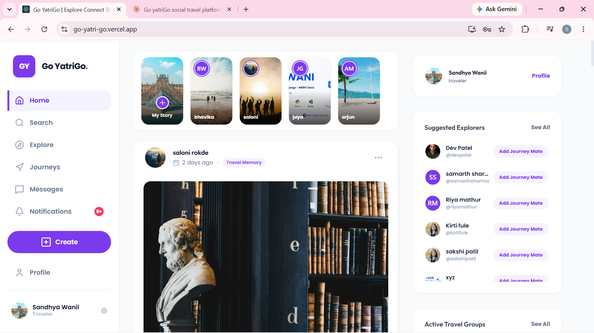

<div align="center">


# 🚀 Go yatriGo

### *Where Journeys Begin and Stories Never End* 🌍

**A full-stack MERN social platform for travelers — built solo, from schema to deployment.**

<p>
  <a href="https://go-yatri-go.vercel.app"></a>
</p>

<p>
  
  
  
</p>

<p>
  
  
  
  
  
  
  
  
</p>

<p>
  <a href="https://go-yatri-go.vercel.app"><b>🔴 Live Demo</b></a> ·
  <a href="#-getting-started"><b>⚙️ Setup Guide</b></a> ·
  <a href="#-connect-with-me"><b>👋 Contact Me</b></a>
</p>

</div>

<br>


## 🔴 Live Demo — Click to Explore

<div align="center">

### 👉 [**Open Go yatriGo Live**](https://go-yatri-go.vercel.app) 👈

<a href="https://go-yatri-go.vercel.app">
  
</a>

<br><br>

<a href="https://go-yatri-go.vercel.app">
  
</a>

*Home feed — Stories, Travel Memories, Suggested Explorers & Active Travel Groups, all in one place.*

</div>

<br>

## 💡 What is Go yatriGo?

**Go yatriGo** is a full-stack social platform built from the ground up — designed for people who believe that every journey is better when shared. It's not just another app; it's a complete ecosystem where you can find your **Journey Mates**, plan **Buddy Trips**, share **Travel Memories**, express **Felt Vibes**, chat in real-time, and even trigger an **Emergency SOS** for safety on the go.

> 🇮🇳 **"Yatri"** means *traveler* in Hindi. **Go yatriGo** = Go, Traveler, Go! 🚀

<br>

## 📊 Project at a Glance

<div align="center">

| 🧩 Mongoose Models | 🛣️ Route Files | 🎮 Controllers | 📄 Frontend Pages | 🧱 Component Dirs |
|:---:|:---:|:---:|:---:|:---:|
| **29** | **17** | **15** | **16+** | **18** |

</div>

<br>

## ✨ Feature Highlights

<table>
<tr>
<td width="50%" valign="top">

### 🤝 Journey Mates
Find and connect with like-minded people. Build your squad of **My Journey Mates** — your travel family who share your vibe.

### 💬 Real-Time Chat
Powered by **Socket.IO** — instant messaging with emoji support, read receipts, and group conversations that keep your crew connected.

### 📸 Travel Memories
Share your journeys as **Travel Memories** with photos, captions, and music. Comment, save, and relive every moment.

### 💜 Felt Vibes
Found a Travel Memory you love? **Feel the vibe!** Your curated collection of Felt Vibes showcases the memories that moved you.

</td>
<td width="50%" valign="top">

### 🗺️ Buddy Trips & Travel Groups
Create **Buddy Trips**, form **Travel Groups**, invite members, set itineraries, and collaborate with a built-in journey workspace, timeline & gallery.

### 🚨 Emergency SOS
One-tap emergency alert system with saved emergency contacts. Your safety is never an afterthought.

### 👤 Rich Profiles
Detailed profiles with cover photos, bio, onboarding checklist, **Journey Mates** system, and a personal timeline of all your Travel Memories and Stories.

### 🛡️ Admin Dashboard
Full admin panel with user management, content moderation, analytics pie charts, and data grid tables for oversight.

</td>
</tr>
</table>

<br>

## 🏛️ Architecture

```
Go yatriGo
├── 🎨 Frontend (React 18 + Tailwind CSS)
│   ├── Pages ──────── Home, Login, Register, Profile, Admin, Settings
│   ├── Components ─── Chat, Journey, Travel Memory, Story, Social, Navbar, Footer
│   ├── Context ────── Auth Context, Socket Context
│   ├── Hooks ──────── Custom data fetching hooks
│   ├── Services ───── API service layer
│   └── Socket ─────── Real-time connection manager
│
├── ⚙️ Backend (Node.js + Express)
│   ├── Controllers ── Auth, User, Chat, Social, Journey, Travel Memory, Emergency
│   ├── Models ─────── 29 Mongoose schemas (User, Journey, Message, Post...)
│   ├── Routes ─────── 17 RESTful route files
│   ├── Middleware ──── JWT auth, token verification, error handling
│   ├── Config ─────── DB connection, JWT setup
│   └── Utils ──────── Cloudinary uploads, email service
│
└── 🗄️ Database (MongoDB)
    └── Collections ── Users, Journeys, Messages, Travel Memories, Stories, Groups...
```

<br>

## 🔧 Tech Stack

<div align="center">

| | | | | | | |
|:---:|:---:|:---:|:---:|:---:|:---:|:---:|
| <br><b>React 18</b> | <br><b>Node.js</b> | <br><b>Express</b> | <br><b>MongoDB</b> | <br><b>Tailwind</b> | <br><b>Vercel</b> | <br><b>Render</b> |

</div>

| Layer | Technologies |
|:------|:------------|
| **Frontend** | React 18 · Tailwind CSS · Framer Motion · React Router v6 · Axios · Socket.IO Client · Recharts · MUI Data Grid · Formik · SweetAlert2 · Lucide Icons |
| **Backend** | Node.js · Express.js · Mongoose · Socket.IO · JWT · Bcrypt.js · Multer · Nodemailer |
| **Database** | MongoDB Atlas |
| **Storage** | Cloudinary CDN (images & media) |
| **Security** | Helmet · CORS · Rate Limiting · XSS Clean · HPP · Mongo Sanitize |
| **Deployment** | Vercel (Frontend) · Render (Backend) |

<br>

## 🧠 Engineering Highlights

*What this project demonstrates, beyond just "it works":*

- **Real-time architecture** — Socket.IO powers live chat, notifications, and presence across the app, not bolted on as an afterthought.
- **Schema design at scale** — 29 interrelated Mongoose models (users, journeys, social graph, moderation, support) designed to avoid duplication and support complex queries.
- **Security-first backend** — layered protection with Helmet, rate limiting, JWT + HTTP-only cookies, input sanitization (XSS/HPP/Mongo injection), and bcrypt password hashing.
- **Full moderation pipeline** — block/report system feeding into an admin dashboard with analytics, not just a hidden database flag.
- **Safety-conscious product thinking** — Emergency SOS wasn't a stretch feature; it shaped how the profile and contacts systems were modeled.
- **Clean separation of concerns** — controller/route/model layering on the backend; context/hooks/services layering on the frontend, built for maintainability as the codebase grew to 29 models and 17 route files.

<br>

## 📂 Project Structure

<details>
<summary><b>📁 Backend — 15 Controllers · 29 Models · 17 Routes</b> (click to expand)</summary>
<br>

```
backend/
├── server.js                    # Entry point + Socket.IO setup
├── config/
│   ├── db.js                    # MongoDB connection
│   └── jwt.js                   # JWT configuration
├── controllers/
│   ├── authController.js        # Login, Register, Password Reset
│   ├── userController.js        # Profile CRUD, Journey Mates system
│   ├── chatController.js        # Chat rooms, messages, real-time
│   ├── socialTravelController.js # Buddy Trips, Travel Groups, social features
│   ├── journeyController.js     # Journey CRUD, workspace, timeline
│   ├── musicController.js       # Background music & playlists
│   ├── emergencyController.js   # SOS & emergency contacts
│   ├── securityController.js    # Privacy & security preferences
│   ├── settingsController.js    # User settings management
│   ├── notificationController.js # Push notifications
│   ├── adminController.js       # Admin operations & moderation
│   ├── contactController.js     # Contact form handling
│   ├── supportController.js     # Help tickets & support
│   ├── legalController.js       # Terms & privacy content
│   └── uploadController.js      # File & image uploads
├── models/                      # 29 Mongoose schemas
│   ├── User.js, Journey.js, Post.js, Story.js, Message.js
│   ├── ChatRoom.js, TravelGroup.js, Comment.js, Follow.js
│   ├── Block.js, Report.js, Notification.js, SavedPost.js
│   ├── EmergencyContact.js, SecurityPreference.js, Session.js
│   ├── JourneyGallery.js, JourneyMemory.js, JourneyTimeline.js
│   ├── JourneyWorkspace.js, JourneyInvitation.js, JourneyMember.js
│   ├── JoinRequest.js, Contact.js, SupportTicket.js
│   ├── FAQ.js, LegalContent.js, ReportProblem.js
│   └── UserSettings.js
├── routes/                      # 17 route files
├── middleware/                   # Auth, token verification, error handling
└── utils/                       # Cloudinary, email service
```

</details>

<details>
<summary><b>📁 Frontend — 16+ Pages · 18 Component Directories</b> (click to expand)</summary>
<br>

```
frontend/src/
├── App.js                       # Root component + routing
├── pages/
│   ├── Home.jsx                 # Travel Memories feed + Stories
│   ├── Login.jsx                # User login
│   ├── Register.jsx             # User registration
│   ├── Profile.jsx              # Profile with Travel Memories, Felt Vibes, Journey Mates
│   ├── Profileupdate.jsx        # Edit profile
│   ├── Admin.jsx                # Admin dashboard
│   ├── ForgotPassword.jsx       # Password recovery
│   ├── ResetPassword.jsx        # Password reset
│   ├── ContactUs.jsx            # Contact form
│   ├── PrivacyPolicy.jsx        # Privacy policy
│   ├── Terms.jsx                # Terms of service
│   └── social/
│       ├── TravelBuddyHub.jsx   # Explore Buddy Trips
│       ├── TravelBuddyDetails.jsx # Buddy Trip details
│       ├── ChatRoom.jsx         # Real-time messaging
│       ├── MyJourneys.jsx       # My Journeys management
│       ├── JourneyDetailsPage.jsx # Journey details
│       ├── CreateBuddyTrip.jsx  # Create Buddy Trips
│       ├── FeltVibes.jsx        # Felt Vibes collection
│       ├── EmergencyContacts.jsx # Emergency contacts
│       ├── Settings.jsx         # User preferences
│       ├── HelpSupport.jsx      # Help & FAQ
│       ├── BlockedUsers.jsx     # Blocked users list
│       └── ReportProblem.jsx    # Report issues
├── components/                  # 18 component directories
│   ├── chat/                    # Chat UI components
│   ├── journey/                 # Journey cards & views
│   ├── post/                    # Travel Memory creation & feed
│   ├── story/                   # Story viewer & creator
│   ├── social/                  # Social interaction widgets
│   ├── profile/                 # Profile sections
│   ├── navbar/                  # Navigation bar
│   ├── footer/                  # Footer
│   ├── admin/                   # Admin panel components
│   ├── modals/                  # Modal dialogs
│   ├── settings/                # Settings panels
│   ├── ui/                      # Reusable UI elements
│   ├── common/                  # Shared components
│   ├── home/                    # Homepage sections
│   ├── services/                # Service components
│   ├── datatable/               # Data grid tables
│   ├── spinner/                 # Loading states
│   └── Layout/                  # Page layout wrapper
├── context/                     # React Context providers
├── hooks/                       # Custom React hooks
├── services/                    # API service functions
├── socket/                      # Socket.IO client setup
├── reducers/                    # State reducers
├── router/                      # Route definitions
├── api/                         # Axios configuration
├── constants/                   # App constants
├── utils/                       # Helper utilities
└── assets/images/               # Static images
```

</details>

<br>

## 🚀 Getting Started

### Prerequisites

<p>
  
  
  
</p>

### 1️⃣ Clone & Install

```bash
git clone https://github.com/sandhyawani/Go-yatriGo.git
cd Go-yatriGo
```

### 2️⃣ Backend Setup

```bash
cd backend
npm install
```

Create a `.env` file in `/backend`:

```env
MONGODB_URI=your-mongodb-connection-string
JWT_SECRET=your-jwt-secret
CLOUDINARY_NAME=your-cloudinary-name
CLOUDINARY_API_KEY=your-api-key
CLOUDINARY_API_SECRET=your-api-secret
SMTP_EMAIL=your-email
SMTP_PASSWORD=your-email-password
```

```bash
npm start          # Production
npm run dev        # Development (with nodemon)
```

### 3️⃣ Frontend Setup

```bash
cd frontend
npm install
npm start
```

> 🌐 App runs at **`http://localhost:3000`**

<br>

## 🔐 Security

Go yatriGo takes security seriously with multiple layers of protection:

| Feature | Implementation |
|:--------|:--------------|
| 🔑 Authentication | JWT tokens with secure HTTP-only cookies |
| 🔒 Password Security | Bcrypt hashing with salt rounds |
| 🛡️ API Protection | Rate limiting, Helmet headers, CORS |
| 🧼 Data Sanitization | XSS Clean, HPP, Mongo Sanitize |
| 🚷 User Safety | Block/Report system, Admin moderation |
| 🚨 Emergency | SOS alerts, Emergency contact management |

<br>

## 📡 API Endpoints

| Route | Description |
|:------|:-----------|
| `/api/auth` | Login, Register, Password Reset, Token Refresh |
| `/api/users` | Profile CRUD, Journey Mates system, Search Users |
| `/api/social/memory` | Create, Like, Comment, Save Travel Memories |
| `/api/chat` | Chat Rooms, Messages, Real-time Events |
| `/api/social/buddy` | Buddy Trips, Felt Vibes, Explore Hub |
| `/api/journey` | Journey CRUD, Workspace, Timeline, Gallery |
| `/api/emergency` | SOS Alerts, Emergency Contacts |
| `/api/security` | Privacy Settings, Security Preferences |
| `/api/admin` | User Management, Content Moderation |
| `/api/notifications` | Push Notifications, Read Status |
| `/api/settings` | User Preferences, Account Settings |
| `/api/support` | Help Tickets, FAQ, Contact Requests |

<br>

## 🔮 What's Next

- [ ] 📍 Location-based recommendations with maps integration
- [ ] 📅 Smart trip planner with AI suggestions
- [ ] 💰 Group budget tracker & expense splitting
- [ ] 🗓️ Shared itinerary builder
- [ ] 📱 Mobile app (React Native)
- [ ] 📊 Advanced analytics & journey insights
- [ ] 🌐 Multi-language support

<br>

## 🤝 Contributing

Contributions are welcome! Here's how:

```bash
# 1. Fork the repo
# 2. Create a feature branch
git checkout -b feature/YourFeature

# 3. Commit your changes
git commit -m "Add YourFeature"

# 4. Push & open a PR
git push origin feature/YourFeature
```

<br>

## 📄 License

This project is licensed under the **MIT License** — see the [LICENSE](LICENSE) file for details.

<br>

## 👋 Connect With Me

<div align="center">

<p>
  <a href="https://github.com/sandhyawani"></a>
  <a href="https://linkedin.com/in/sandhyawani"></a>
  <a href="https://go-yatri-go.vercel.app"></a>
  <a href="mailto:sandhyawani85@gmail.com"></a>
</p>

**Built with 💜 by Sandhya Wani**

<p>
  <a href="https://github.com/sandhyawani/Go-yatriGo"></a>
  <a href="https://github.com/sandhyawani/Go-yatriGo/issues"></a>
  <a href="https://github.com/sandhyawani/Go-yatriGo/pulls"></a>
</p>

*Go yatriGo — Because every journey matters.* 💜

</div>
