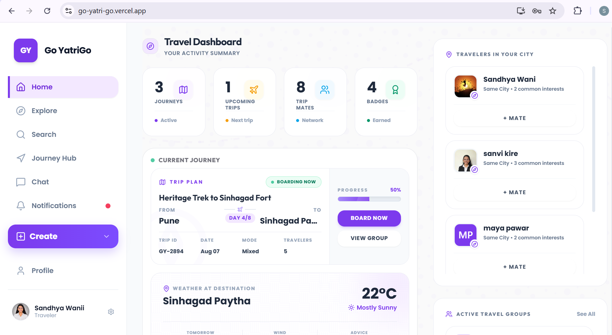
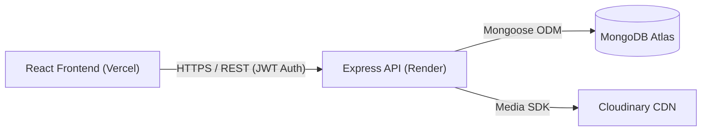
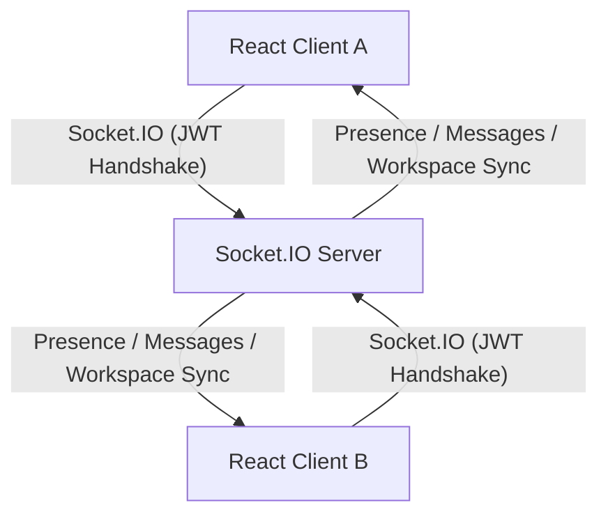
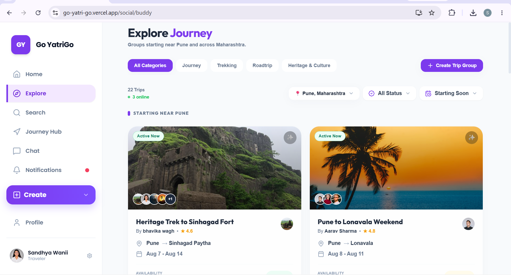
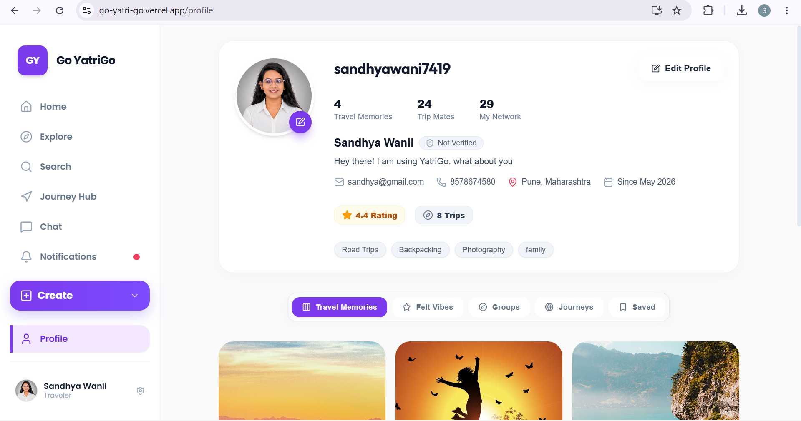

# Go yatriGo

> A full-stack travel-focused social ecosystem connecting travelers, facilitating collaborative journey planning, real-time communication, travel memory sharing, and built-in safety tools.

<p align="center">
  <a href="https://go-yatri-go.vercel.app"></a>
</p>

<p align="center">
  
  
  
  
  
  
  
  
</p>

<p align="center">
  <a href="https://go-yatri-go.vercel.app"><b>🌐 Live Application</b></a> •
  <a href="https://go-yatrigo.onrender.com/api"><b>⚙️ Production API Endpoint</b></a> •
  <a href="#-getting-started"><b>🛠️ Setup Instructions</b></a>
</p>

---

## 🌍 Why Go yatriGo?

Traveling solo or coordinating group trips inherently presents friction:
1. **Finding Compatible Travel Buddies:** Discovering reliable companions who share your budget, dates, travel style, and vibe is difficult on generic platforms.
2. **Fragmented Planning Workflows:** Juggling separate applications for group chat, itinerary notes, member invitations, and travel media creates disorganized travel planning.
3. **Disconnected Safety Infrastructure:** Most travel platforms lack integrated emergency contacts or one-tap SOS features for active journeys.
4. **Context-Free Social Sharing:** Generic social networks detach trip photos and stories from the actual journey, itinerary, and companions.

**Go yatriGo** (*"Yatri"* = *Traveler* in Hindi) unifies travel buddy discovery, journey planning, real-time chat, memory archiving, and safety tools into one **Journey-Centered Ecosystem**.

---

## 💡 What Go yatriGo Solves

| Real-World Travel Problem | Go yatriGo Solution |
| :--- | :--- |
| Hard to find compatible travel companions | **Travel Buddy Hub:** Filter explorers by destination, interests, travel style, and dates |
| Trip planning scattered across multiple tools | **Journey Workspace & Itinerary:** Collaborative journey management with timelines |
| Chat disconnected from trip context | **Integrated Socket.IO Chat:** Real-time group & journey messaging with read/delivery states |
| Photos & stories lose trip context | **Travel Memories & Felt Vibes:** Share posts, stories, and curate inspiring travel vibes |
| Emergency tools are external | **One-Tap Emergency SOS:** Saved emergency contacts with instant geolocation alerts |

<a href="https://go-yatri-go.vercel.app">
   
</a>

---

## ⭐ Core Product Concept

The central engine of Go yatriGo is the **Journey Ecosystem**, built on a structured lifecycle that guides users from initial discovery to lasting memories:

```text
Discover Travelers ➔ Connect Buddies ➔ Create / Join Journey ➔ Invite Members ➔ Collaborative Planning ➔ Real-Time Chat ➔ Travel Safely ➔ Preserve Memories
```

Rather than treating posts or messages in isolation, every interaction—invitation, itinerary change, real-time message, shared memory, and badge progress—is tethered to the **Journey entity**, maintaining full contextual continuity.

---

## ✨ Key Features

### 🤝 Travel Buddy Discovery & Social Connections
* **Traveler Matching:** Filter and explore travelers by destination, interests, budget, and travel style.
* **Journey Mates:** Follow/unfollow system to build a trusted network of travel companions.
* **User Profiles:** Comprehensive profiles featuring bio, cover photo, location, journey stats, and onboarding checklists.

### 🗺️ Journey Creation & Capacity Management
* **Flexible Journey Types:** Support for Solo, Friends, and Group journeys with configurable privacy levels (*Public*, *Followers Only*, *Friends Only*, *Private*).
* **State Lifecycle:** Journeys transition seamlessly across `Planning` ➔ `Upcoming` ➔ `Ongoing` ➔ `Completed` ➔ `Cancelled` / `Archived`.
* **Atomic Member & Invitation Controls:** Invitations, join requests, member role assignments (*Organizer*, *Co-Organizer*, *Member*), and server-enforced max-capacity checks.

### 💬 Real-Time Chat & Workspace Collaboration
* **Socket.IO Real-Time Chat:** Journey group chats and direct messaging featuring typing indicators, read receipts (`seenBy`), delivery tracking (`deliveredTo`), and unread badges.
* **User Presence:** Automatic online/offline status detection with reconnection fallback logic.
* **Live Workspace Syncing:** Real-time workspace editing state notifications (`workspace_change`, `workspace_editing_start/stop`).

### 📸 Travel Memories, Felt Vibes & Stories
* **Travel Memories:** Rich photo posts with captions, locations, attached audio/music tracks, and comments.
* **Felt Vibes:** Bookmark and curate inspiring travel memories into a personal collection.
* **Ephemeral Stories:** 24-hour travel dispatches with view tracking and media support.

### 🚨 Emergency SOS & Safety Systems
* **Emergency Contacts:** Store trusted emergency contacts with name, phone, relationship, and email.
* **Instant SOS Alerting:** One-tap alert mechanism broadcasting current location coordinates and emergency details.
* **Safety Guidelines:** Built-in community guidelines and travel safety advisories.

### 🛡️ Admin Moderation & Analytics
* **Admin Dashboard:** Moderation panel featuring user management, verification requests, report resolution, and support ticket management.
* **Analytics Grid:** Visual breakdown of platform metrics using custom Recharts pie charts and Material-UI Data Grids.

---

## 🔄 How It Works

1. **Authentication & Profile Setup:** Register an account, set up travel preferences, upload a profile avatar/cover image via Cloudinary, and receive a secure JWT.
2. **Discover & Connect:** Browse the **Travel Buddy Hub** to find explorers going to your destination or connect with **Journey Mates**.
3. **Form a Journey:** Create a new journey or apply to join an existing group trip.
4. **Collaborate & Plan:** Assign member roles, manage member invitations, build the timeline, and edit the journey workspace.
5. **Communicate in Real Time:** Enter the dedicated journey chat room powered by Socket.IO for instant messaging and presence updates.
6. **Travel with Safety:** Access the Emergency SOS module anytime during active travel to dispatch instant alerts if needed.
7. **Document & Relive:** Post **Travel Memories** and **Stories** during or after the trip, and save inspiring memories from other travelers as **Felt Vibes**.

---

## 🏗️ Architecture

Go yatriGo follows a decoupled client-server architecture with REST API endpoints for state management and Socket.IO websockets for bi-directional real-time events.

### HTTP & REST Data Flow

```mermaid
flowchart LR
    Client["React Frontend (Vercel)"] -- "HTTPS / REST (JWT Auth)" --> Server["Express API (Render)"]
    Server -- "Mongoose ODM" --> DB[("MongoDB Atlas")]
    Server -- "Media SDK" --> Cloudinary["Cloudinary CDN"]
```

### Real-Time Websocket Flow

```mermaid
flowchart TD
    Client1["React Client A"] -- "Socket.IO (JWT Handshake)" --> SocketServer["Socket.IO Server"]
    Client2["React Client B"] -- "Socket.IO (JWT Handshake)" --> SocketServer
    SocketServer -- "Presence / Messages / Workspace Sync" --> Client1
    SocketServer -- "Presence / Messages / Workspace Sync" --> Client2
```

---

## 🧩 Technical Implementation Details

### 1. MongoDB Atomic Capacity & Conditional Enforcements
To prevent race conditions when multiple users attempt to join a journey simultaneously, capacity limits are enforced at the database level using atomic update operations with `$expr`:
```javascript
// Server-side atomic capacity check during journey join request approval
const updatedJourney = await Journey.findOneAndUpdate(
  {
    _id: journeyId,
    $expr: { $lt: [{ $size: "$members" }, "$maxMembers"] }
  },
  { $addToSet: { members: { user: userId, role: "Member" } } },
  { new: true }
);
```

### 2. Socket.IO Authentication Handshake & Presence Engine
Websocket connections undergo token verification during the handshake phase before connection establishing. Online status is managed via a in-memory `Set` per user with reconnection grace periods to handle temporary network dropouts without flickering status indicators.

### 3. Unified Journey Statistics API
User travel metrics (total journeys created, total travel days calculated dynamically from start/end dates, companion counts) are calculated via a single-source-of-truth aggregation pipeline (`getUserJourneyStats`), ensuring consistent statistics across profile pages, cards, and admin metrics.

### 4. Security & Data Sanitization Middleware Pipeline
* **Express Rate Limiting:** Dedicated rate limiters for authentication endpoints (`authLimiter`: 30 req/15min) and API routes (`apiLimiter`: 300 req/15min).
* **Sanitization:** `express-mongo-sanitize` prevents NoSQL injection attacks, `xss-clean` strips malicious HTML payloads, and `hpp` defends against HTTP Parameter Pollution.
* **Security Headers:** `helmet` configures HTTP security headers.
* **Request Correlation:** Custom `requestIdMiddleware` attaches unique UUIDs to incoming requests for WinSton/Morgan structured logging.

---

## 🛠️ Tech Stack

| Layer | Technology | Purpose |
| :--- | :--- | :--- |
| **Frontend Core** | React v18.2 | Single-page application UI rendering |
| **Routing** | React Router v6.10 | Client-side page navigation & protected routes |
| **Styling** | Tailwind CSS v3.3 + MUI | Modern responsive design system |
| **State & HTTP** | Axios + Context API | REST API client with Bearer token interceptors |
| **Real-time Client**| Socket.IO Client v4.8 | Client-side websocket connection management |
| **Data Visualization**| Recharts + MUI DataGrid | Admin analytics charts and management tables |
| **Backend Framework**| Node.js + Express v4.18 | REST API server & business logic controller layer |
| **Database & ODM** | MongoDB Atlas + Mongoose v7.0 | Document storage, validation schemas, indexing |
| **Authentication** | JSON Web Tokens (JWT) + BcryptJS | Stateless auth & salted password hashing |
| **Real-time Server**| Socket.IO v4.8 | Server-side websocket gateway & presence tracking |
| **Media Management**| Multer + Cloudinary SDK | Image upload processing & CDN delivery |
| **Security** | Helmet, Rate-Limit, Mongo-Sanitize | Enterprise-standard security middleware pipeline |
| **Infrastructure** | Vercel (Frontend), Render (Backend) | Cloud hosting & continuous deployment |

---

## 📊 Project Structure

```text
Go yatriGo
├── backend/
│   ├── config/              # DB connection, JWT, & env validation
│   ├── controllers/         # 15 Controller files (auth, journey, chat, social...)
│   ├── middleware/          # JWT verify, requestId, error handling
│   ├── models/              # 30 Mongoose Schemas (User, Journey, Message, Post...)
│   ├── routes/              # 18 Express REST route modules
│   ├── utils/               # Cloudinary, logger, privacy & block helpers
│   └── server.js            # Express & Socket.IO server initialization
│
└── frontend/
    ├── public/              # HTML template & static assets
    └── src/
        ├── api/             # Axios instance & interceptors
        ├── assets/          # Application images & design vectors
        ├── components/      # 19 Component directories (chat, journey, admin, ui...)
        ├── context/         # AuthContext, SocketContext, ChatProvider
        ├── hooks/           # Custom data hooks (useProfile, useFetch...)
        ├── pages/           # Page components (Home, Profile, Admin, BuddyHub...)
        ├── router/          # Client-side RouteTour & ProtectedRoute definitions
        ├── services/        # Service API wrappers
        └── socket/          # Socket dispatcher logic
```

---

## 🧪 Testing & Quality Assurance

* **Input & Payload Validation:** Regex-based validation on client forms (email, phone, username format, password strength metrics) combined with Mongoose schema validation constraints on the server.
* **Middleware Integrity:** Strict token authentication checks on protected endpoints and Socket.IO handshake verification.
* **Testing Setup:** The frontend repository is initialized with Create React App testing scripts (`npm test`). Dedicated automated unit/integration test suites can be expanded within this framework.

---

## 🚀 Getting Started

### Prerequisites
* **Node.js** (v18.x or higher)
* **npm** (v9.x or higher)
* **MongoDB Atlas Connection URI**
* **Cloudinary Account** (for media storage)

### 1. Clone the Repository
```bash
git clone https://github.com/sandhyawani/Go-yatriGo.git
cd "Go yatriGo"
```

### 2. Backend Setup
```bash
# Navigate to backend
cd backend

# Install dependencies
npm install

# Start development server
npm run dev
```

### 3. Frontend Setup
```bash
# Open a new terminal window and navigate to frontend
cd frontend

# Install dependencies
npm install

# Start React development server
npm start
```

The frontend will run at `http://localhost:3000` and connect to the backend server running at `http://localhost:5000`.

---

## 🔐 Environment Variables

Create a `.env` file in the `backend/` directory:

```env
# Server Configuration
PORT=5000
NODE_ENV=development
CLIENT_URL=http://localhost:3000

# Database
MONGO_URI=mongodb+srv://<username>:<password>@cluster.mongodb.net/yatrigo

# Authentication
JWT_SECRET=your_jwt_secret_key

# Cloudinary Storage
CLOUDINARY_CLOUD_NAME=your_cloud_name
CLOUDINARY_API_KEY=your_api_key
CLOUDINARY_API_SECRET=your_api_secret
```

Create a `.env` file in the `frontend/` directory:

```env
REACT_APP_API_URL=http://localhost:5000/api
REACT_APP_SOCKET_URL=http://localhost:5000
REACT_APP_CLOUDINARY_CLOUD=your_cloud_name
REACT_APP_CLOUDINARY_PRESET=your_preset_name
REACT_APP_CLOUDINARY_URL=https://api.cloudinary.com/v1_1/your_cloud_name/image/upload
```

---

## 📸 App Screenshots

<div align="center">

  <p><b>Travel Dashboard</b></p>
  

  <br><br>

  <p><b>Mobile Dashboard & Travel Dispatches</b></p>
  
  &nbsp; &nbsp;
  

  <br><br>

  <p><b>Explore Travel Buddy Hub</b></p>
  

  <br><br>

  <p><b>Journey Hub</b></p>
  

  <br><br>

  <p><b>User Profile & Travel Timeline</b></p>
  

</div>

---

## 📈 Engineering Highlights

* **Atomic MongoDB Concurrency:** Race-condition-free journey joining via `$expr` size checks directly inside atomic `findOneAndUpdate` queries.
* **State-Aware Socket.IO Engine:** Websocket gateway with token verification, real-time message delivery tracking (`deliveredTo`), read receipts (`seenBy`), typing indicators, and presence syncing.
* **Single Source of Truth Stats:** Dynamic travel statistics calculation (`totalJourneys`, `travelDays`, `companionsCount`) avoiding data duplication.
* **Defense-in-Depth Security:** Layered request filtering including rate limiting, NoSQL injection sanitization, XSS clean, HTTP Parameter Pollution protection, and Helmet security headers.

---

## 🎯 What This Project Demonstrates

* **Full-Stack MERN Mastery:** Seamless integration between React, Node.js, Express, and MongoDB.
* **Real-Time Systems Architecture:** Building bi-directional communication with Socket.IO authentication and state tracking.
* **Data Modeling & Integrity:** Structuring 30 interlinked Mongoose schemas with indexed references and virtual fields.
* **User-Centric Engineering:** Combining social networking features with practical travel tools and emergency safety infrastructure.

---

## 📄 License

This project is licensed under the **ISC License**.
